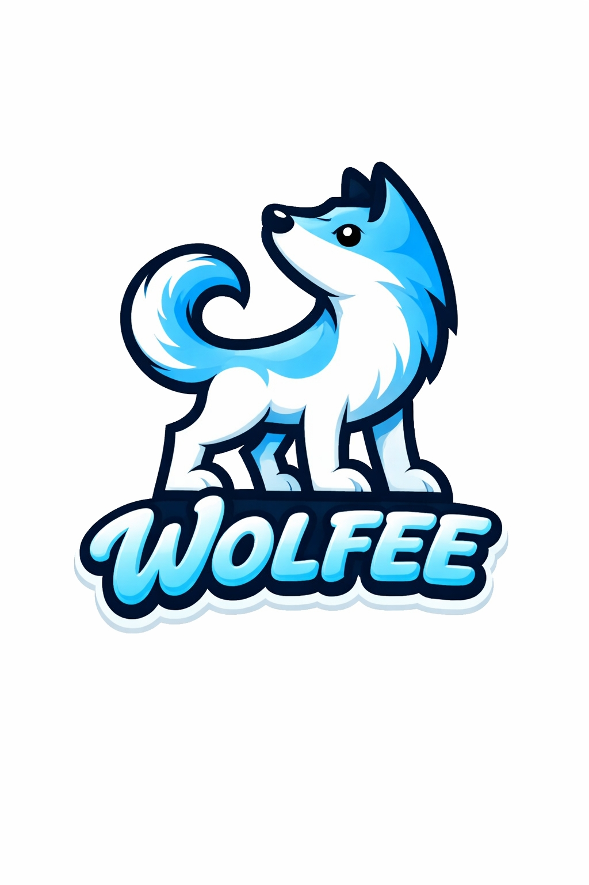
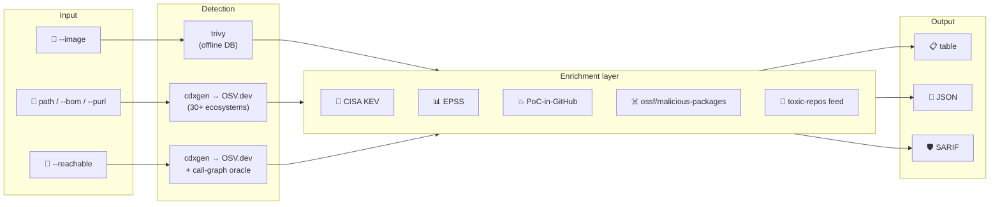
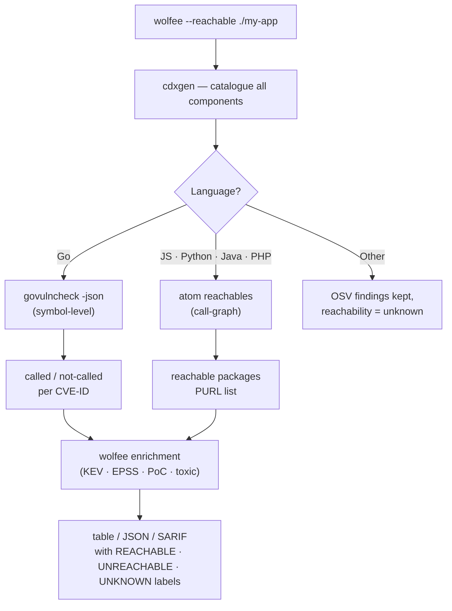

<div align="center">
  

  # Wolfee CLI

  **Vulnerability scanner with enrichment superpowers**

  [](https://github.com/shinigamikiko/wolfee-cli/actions/workflows/ci.yml)
  [](https://go.dev/)
  [](https://github.com/shinigamikiko/wolfee-cli/releases)
  [](https://github.com/aquasecurity/trivy)
  [](https://www.cisa.gov/known-exploited-vulnerabilities-catalog)

  [Quick Start](#quick-start) · [Usage](#usage) · [Output Formats](#output-formats) · [CI Gating](#ci-gating) · [Configuration](#configuration)
</div>

---

Wolfee picks up where other scanners stop. It wraps **trivy** (for container images) and **cdxgen + OSV.dev** (for source projects), then layers every finding with real-world context: is this CVE actively exploited? Does a public proof-of-concept exist? Is the dependency itself malicious or toxic?

```bash
wolfee --image nginx:latest
```

One command. No local database to warm up. Enriched results in seconds.

---

## How It Works



---

## Scan Modes

| Mode | Flag | Backend | Best for |
|------|------|---------|----------|
| Container image | `--image <ref>` | trivy (offline DB) | Docker/OCI images, registry references |
| Image vs your SBOM | `--image <ref> --compare <src>` | trivy + cdxgen + govulncheck/atom | Split image packages APP (yours) vs IMAGE (not), reachability on APP |
| Project source | `<path>` | cdxgen + OSV.dev | Monorepos, multi-language projects |
| Existing SBOM | `--bom <file>` | OSV.dev | CycloneDX BOM files |
| Single package | `--purl <purl>` | OSV.dev | Ad-hoc PURL lookups |
| Reachability (Go) | `--reachable <dir>` | cdxgen + OSV.dev + govulncheck | Symbol-level call-graph for Go |
| Reachability (JS/Python/Java/PHP) | `--reachable <dir>` | cdxgen + OSV.dev + atom | Package-level call-graph |

---

## Enrichment Feeds

Every finding, regardless of scan mode, is enriched with:

| Feed | Source | What it adds |
|------|--------|-------------|
| **CISA KEV** | cisa.gov | `KEV` flag — actively exploited in the wild |
| **EPSS** | api.first.org | Exploit probability score (0–1) |
| **PoC-in-GitHub** | github.com/nomi-sec/PoC-in-GitHub | Public proof-of-concept link |
| **ossf/malicious-packages** | github.com/ossf/malicious-packages | Day-zero malware hits by package name |
| **toxic-repos** | github.com/toxic-repos/toxic-repos | DDOS payloads, geo-blocks, hostile changes |

Feeds are cached to disk (TTL + conditional GET). Zero pre-warming needed.

---

## Quick Start

### Install

```bash
# From source (requires Go 1.21+)
go install github.com/shinigamikiko/wolfee-cli/cmd/wolfee@latest

# Or build locally
git clone https://github.com/shinigamikiko/wolfee-cli
cd wolfee-cli
make build          # → ./bin/wolfee
make tools          # → ./bin/trivy + ./bin/govulncheck
```

### Docker

```bash
make docker         # builds wolfee + trivy + cdxgen + atom
docker run --rm wolfee --image nginx:latest
```

### Runtime dependencies

| Mode | Requires |
|------|---------|
| `--image` | `trivy` on PATH (or `--trivy-bin <path>`) |
| path / `--bom` / `--reachable` | `cdxgen` on PATH |
| `--reachable` (Go) | `govulncheck` on PATH (or `--govulncheck-bin <path>`) |
| `--reachable` (JS / Python / Java / PHP) | `atom` + `atom-parsetools` on PATH (or `--atom-bin <path>`) |

---

## Usage

### Scan a container image

```bash
wolfee --image nginx:1.27
wolfee --image my-app:latest --platform linux/arm64
wolfee --image my-app:latest --save-sbom my-app.cdx.json

# Tell base-image packages apart from your own (see below)
wolfee --image my-app:latest --scout

# Pass raw trivy flags (air-gapped DB mirror, offline mode, etc.)
wolfee --image my-app:latest \
  --trivy-arg=--offline-scan \
  --trivy-arg=--db-repository=registry.corp/aquasecurity/trivy-db
```

### Base image vs your layers (`--scout`)

A container image is a stack of layers: the ones from the base image you
chose (`FROM …`) and the ones your build added on top. A CVE in a base
layer is usually fixed by **bumping the base image**; a CVE in your own
layer is **yours to fix**. Wolfee can tell them apart so you know what to
look at first.

Each finding gets an **`ORIGIN`** column:

| Token | Meaning | Typical action |
|-------|---------|----------------|
| `APP` | package added by *your* layers | triage now — it's your dependency |
| `BASE` | non-OS package shipped in the base image | bump / rebuild the base image |
| `DEB` / `APK` / `RPM` | OS package (apt/apk/dnf) | distro-managed — `apt upgrade` / base update |
| `—` | not attributed (`--scout` off, no base found, or squashed layer) | run with `--scout` |

```bash
# Attribute every package BASE vs APP
wolfee --image my-app:latest --scout

# Works on arbitrary third-party images too (docker scout fallback)
wolfee --image registry/some/image:tag --scout
```

**One flag, base detected automatically (`--scout`).** You don't name the
base — wolfee finds it, local-first:

1. **OCI base-image labels** (`org.opencontainers.image.base.*`) — stamped
   by BuildKit, digest-pinned, authoritative. Free and offline.
2. **The rootfs-import line in the image history** — an image built
   `FROM scratch` + `ADD alpine-minirootfs-3.19.9-x86_64.tar.gz /` carries
   no labels, but the distro and version are right there in the layer's
   `created_by`, so wolfee derives `alpine:3.19.9` from it. Free and offline.
3. **[Docker Scout](https://docs.docker.com/scout/)** — only when 1 and 2
   find nothing, e.g. an arbitrary image with an anonymised rootfs
   (`ADD file:<sha> in /`) and no labels. Scout matches the image's layers
   against its cloud database of known base images and names the base.

The Scout fallback has real requirements: the `docker scout` CLI plugin, a
running Docker daemon, and `docker login` — and it uploads image metadata
to Docker's cloud, so it does **not** work air-gapped. If the plugin is
missing or you're not logged in, attribution is skipped with a warning and
the scan continues (you still get `DEB`/`APK`/`RPM` on OS packages). Most
labelled or distro-rootfs images never reach step 3.

Whatever the base, it is hash-verified against the layer stack (below), so
a wrong guess degrades to `—`, never a wrong label. Without `--scout` no
base is resolved at all — a plain scan never pulls a base or calls out.

**How it's decided — by content hash, not heuristics.** Every layer has a
**DiffID** (the SHA-256 of its uncompressed contents), and trivy reports
the DiffID each package was found in. Wolfee resolves the base image's
ordered DiffIDs and verifies they are an exact **prefix** of the scanned
image's layers (an image built `FROM` a base carries that base's layers,
byte-for-byte, as its leading layers). A package whose layer DiffID is in
that prefix is provably from the base; everything else is yours. If the
resolved base **doesn't** match the image's layer stack (wrong/stale tag,
squashed image, no layer metadata) wolfee leaves the origin `unknown`
rather than guess.

`origin` is also emitted in JSON (`"origin": "app"`) and as a SARIF result
property, so you can gate or filter on it downstream. Resolving the base
runs trivy against it once (layers are cached); when no base is resolved,
attribution is skipped, only OS packages are tagged (`DEB`/`APK`/`RPM`),
and the table prints a one-line hint pointing at `--scout`.

### Image vs your SBOM (`--compare`)

An image is a mix of *your* application's libraries and a lot of things that
just came along for the ride — the base image, OS packages, binaries copied
in at build time. `--compare <src>` separates the two by comparing the image
against your application's **own SBOM** (cataloguing the source tree with
cdxgen), and tags every image finding in the `ORIGIN` column:

| `ORIGIN` | meaning |
|----------|---------|
| `APP` | one of **your** libraries, direct (in your SBOM) |
| `APP(T)` | one of your libraries, transitive (indirect) |
| `LIB(image)` | a **language library in the image** but not in your source (e.g. a copied CLI tool's deps) |
| `DEB(image)`/`APK(image)`/`RPM(image)` | **OS package from the image** |
| `DEB`/`APK`/`RPM` | OS package (plain `--image`, image-vs-source not computed) |

The `(image)` qualifier means "ships in the image, not in your source" — so
within everything that isn't yours you can still tell an OS package from a
stray bundled library.

```bash
wolfee --image my-app:latest --compare ./src
```

Vulnerabilities are reported from **both** engines: the image (trivy) **and**
your sources (OSV over the cdxgen SBOM). A source-declared vulnerable library
that isn't in the image is still listed (as `APP`); a clean source library is
not, so the inventory stays the image's. Transitive (indirect) `APP`
dependencies are flagged **`transitive`** from their SBOM scope, so you can
tell a direct dependency from one pulled in underneath it.

On top of that, the call-graph analyzers run over the same source tree and
mark the **`APP`** findings `reachable` / `unreachable`:

- **Go** → `govulncheck` (symbol-level), including the application's `stdlib`.
- **JS / Python / Java / PHP** → `atom` (package/flow-level).

`IMAGE` packages are deliberately **not** analyzed for reachability — "does
our code call it?" isn't a meaningful question for a foreign binary's
dependencies, so they're left unmarked rather than guessed at.

Needs the image's source tree on disk, `cdxgen` for the SBOM, and the
relevant analyzer on PATH (`govulncheck` / `atom`, or `--govulncheck-bin` /
`--atom-bin`). Mutually exclusive with `--scout` — both drive `ORIGIN`, one
by SBOM membership, the other by base-image layers.

### Scan a project

```bash
wolfee ./my-app                      # auto-detect languages, match OSV
wolfee --reachable ./my-app          # filter to reachable vulnerabilities only
```

### Scan an existing SBOM

```bash
wolfee --bom existing.cdx.json
```

### Single package lookup

```bash
wolfee --purl pkg:npm/lodash@4.17.20
wolfee --purl pkg:pypi/discordpydebug@1.0
```

---

## Reachability Analysis

`--reachable` cuts through CVE noise by asking a harder question: is this vulnerable code path actually reachable from your own code? Two separate engines handle the analysis — the right one is chosen automatically based on what's in the project.



### Go — best support (govulncheck)

Go gets **symbol-level** reachability via `govulncheck`. It performs a full static call-graph analysis and tells you not just which package is vulnerable, but whether the specific vulnerable *function* is reachable from your code — and from exactly which line.

What you get per finding:
- **REACHABLE** — the vulnerable symbol is called (transitively) from your code
- **UNREACHABLE** — the vulnerable package is imported, but the unsafe code path is never invoked
- Call site: `internal/handler/serve.go:142` — exact file and line in *your* code that reaches the vuln
- Source line at the call site, trimmed for the table renderer

Works across **polyglot monorepos**: wolfee walks every `go.mod` it finds under the scan root and runs govulncheck against each module independently.

```bash
# Go project
wolfee --reachable ./my-go-service

# Monorepo with multiple Go modules
wolfee --reachable ./monorepo   # scans each go.mod sub-directory

# Custom govulncheck binary (air-gapped / pinned version)
wolfee --reachable ./my-go-service --govulncheck-bin ./bin/govulncheck
```

Example output (table):
```
CVE-2024-34156   net/http        HIGH    REACHABLE   internal/proxy/forward.go:88
CVE-2023-44487   golang.org/x/net CRITICAL UNREACHABLE  (imported, never called)
```

Requires `govulncheck` on PATH:
```bash
go install golang.org/x/vuln/cmd/govulncheck@latest
# or
make tools   # installs into ./bin/govulncheck
```

### JS / Python / Java / PHP — moderate support (atom)

For these languages wolfee uses [`atom`](https://github.com/appthreat/atom) to build a code-graph and extract the set of packages that appear on any reachable call flow. This is **package-level** (not symbol-level): a package is either on a reachable path or it isn't.

Language detection is manifest-driven — atom only runs for languages whose manifest exists in the tree:

| Language | Detected by | atom `-l` value |
|----------|-------------|-----------------|
| JavaScript / Node.js | `package.json` | `javascript` |
| Python | `requirements.txt`, `pyproject.toml`, `setup.py`, `Pipfile`, `poetry.lock` | `python` |
| Java | `pom.xml`, `build.gradle`, `build.gradle.kts` | `java` |
| PHP | `composer.json` | `php` |

Polyglot repos are supported: each language gets its own atom run, and results are merged before enrichment.

```bash
# Node.js service
wolfee --reachable ./my-node-app

# Django app
wolfee --reachable ./my-django-service

# Spring Boot
wolfee --reachable ./my-java-service

# Custom atom binary
wolfee --reachable ./my-node-app --atom-bin /opt/atom/bin/atom
```

> **Java note:** atom requires a JDK 21+ on PATH. The wolfee Docker image ships one. Without JDK, atom exits with a clear error and the scan continues with reachability = unknown for Java packages.

Atom failures (OOM, missing binary, parse errors) are non-fatal: affected packages keep their reachability as `UNKNOWN`, and the rest of the scan — CVE detection + all enrichment — completes normally.

### JavaScript / TypeScript / npm — import-level (weak)

For npm projects wolfee uses its own **import-graph scanner**: it walks every `.js`, `.jsx`, `.ts`, `.tsx`, `.mjs`, `.cjs` file in the project and checks for `import … from 'pkg'` / `require('pkg')` statements. If `package-lock.json` is present, transitive dependencies of directly-imported packages are also marked reachable.

This is deliberately lightweight — no JVM, no call-graph, no AST. The trade-off is coarse granularity:

- A package with zero `import` statements anywhere in your source is flagged **not-used**.
- Any package that appears in at least one import is marked **imported** — but whether the specific vulnerable code path inside it is ever reached is unknown.

```bash
wolfee --reachable ./my-node-app   # scans *.js / *.ts for import statements
wolfee --reachable ./my-ts-app     # TypeScript handled the same way
```

> **Python** works identically: `import foo` / `from foo import` statements are scanned across `.py` files. Packages whose import name differs from the PyPI name (e.g. `PIL` → `Pillow`, `cv2` → `opencv-python`) stay `UNKNOWN` rather than `not-used`.

### Ruby, Rust, C/C++, .NET…

No analysis. Findings are reported from OSV.dev with reachability = `UNKNOWN`. KEV / EPSS / PoC enrichment still runs normally.

| Language / Ecosystem | Engine | Granularity |
|----------------------|--------|-------------|
| Go | govulncheck | Symbol-level — called / not-called + exact call site |
| Java / Maven | atom | Package-level — call-graph (needs JDK 21+) |
| PHP / Composer | atom | Package-level — call-graph |
| JavaScript / TypeScript / npm | import-graph | Import-level — is the package referenced in source at all? |
| Python | import-graph | Import-level — is the package referenced in source at all? |
| Ruby / Rust / C / .NET / other | — | UNKNOWN |

### Required tools for `--reachable`

```bash
# Go reachability
go install golang.org/x/vuln/cmd/govulncheck@latest

# JS / Python / Java / PHP reachability
# atom-parsetools ships atom's frontend parsers (astgen for JS/TS,
# phpastgen for PHP) — atom can't build a call graph without it
npm install -g @appthreat/atom @appthreat/atom-parsetools

# Or install everything in one shot
make tools
```

The wolfee Docker image (`make docker`) ships all of these: govulncheck, atom, atom-parsetools, and a JDK 21+.

---

## Output Formats

```bash
# Coloured terminal table (default)
wolfee --image nginx:1.27

# Machine-readable JSON
wolfee --image nginx:1.27 --format json --output report.json

# SARIF — plugs directly into GitHub Code Scanning, GitLab, Sonar, Azure DevOps
wolfee --image nginx:1.27 --format sarif --output report.sarif
```

---

## CI Gating

```bash
# Exit 2 if any HIGH or CRITICAL finding (or malware detected)
wolfee --image my-app:latest --fail-on high
```

| Exit code | Meaning |
|-----------|---------|
| `0` | Clean — no findings above threshold |
| `1` | Tool error (network, malformed SBOM, cdxgen failure) |
| `2` | Threshold breached (`--fail-on`) |

### GitHub Actions example

```yaml
- name: Wolfee scan
  run: wolfee --image ${{ env.IMAGE_REF }} --format sarif --output wolfee.sarif --fail-on high

- name: Upload to Code Scanning
  uses: github/codeql-action/upload-sarif@v3
  with:
    sarif_file: wolfee.sarif
  if: always()
```

---

## Configuration

No config file. Everything works out of the box. Optional environment variables:

| Variable | Default | Description |
|----------|---------|-------------|
| `WOLFEE_TOKEN` | — | Auth token for `--server` upload (keeps token off shell history) |
| `GITHUB_TOKEN` | — | Lifts GitHub anonymous rate limit from 60 → 5 000 req/hr |
| `NO_COLOR` | — | Disable terminal colours (universal convention) |
| `WOLFEE_FEEDS_CACHE_DIR` | `~/.cache/wolfee/feeds` | Override feed cache directory |
| `WOLFEE_FEEDS_OFFLINE=1` | — | Air-gapped mode — serve only from cache, never hit network |
| `WOLFEE_FEED_URL_EPSS` | api.first.org (canonical) | Mirror URL for EPSS daily CSV |
| `WOLFEE_FEED_URL_KEV` | cisa.gov (canonical) | Mirror URL for CISA KEV JSON |
| `WOLFEE_FEED_URL_DLA_LIST` | debian.org (canonical) | Mirror URL for Debian DLA list |
| `WOLFEE_FEED_URL_DSA_LIST` | debian.org (canonical) | Mirror URL for Debian DSA list |
| `WOLFEE_NVD_CACHE_FILE` | — | Override NVD cache file path |
| `WOLFEE_NVD_CACHE=off` | — | Disable NVD cache |

### Feed caching

Single-file feeds (EPSS CSV, CISA KEV, Debian DLA/DSA) are cached to disk. On TTL expiry, wolfee issues a conditional GET — most upstream feeds respond `304 Not Modified`, downloading nothing. Per-CVE feeds (NVD, PoC-in-GitHub) cache independently.

### Toxic-repos overlay

Extend or override the public toxic-repos feed with your own curated list:

```json
{
  "packages": {
    "pkg:npm/colourama":        { "category": "typosquat" },
    "pkg:npm/event-stream@3.3.6": { "category": "hijacked" },
    "pkg:pypi/requesocks":      "abandoned"
  },
  "repositories": [
    "github.com/sketchy-org/random-fork"
  ]
}
```

Set `WOLFEE_TOXIC_URL` to point at your overlay file (local path or HTTP URL). Categories appear in output as `TOXIC[typosquat]`, `TOXIC[hijacked]`, etc.

---

## Architecture

<details>
<summary>Directory layout</summary>

```
wolfee-cli/
├── cmd/wolfee/main.go              entry — flag dispatch only
├── go.mod                          3 external deps total
└── internal/
    ├── cli/                        per-subcommand flag parsing
    │   ├── cli.go                  dispatcher
    │   ├── scan.go                 scan command (image|bom|purl|path|reachable)
    │   └── version.go              wolfee version
    ├── trivy/                      trivy subprocess wrapper (--image)
    ├── cdxgen/                     cdxgen subprocess wrapper (non-image)
    ├── reachability/               call-graph oracle (--reachable)
    │   ├── govulncheck.go          Go symbol-level analysis
    │   └── atom.go                 JS / Python / Java / PHP analysis
    ├── onlinescan/                 OSV detect + KEV/EPSS/PoC/toxic enrichment
    │   ├── enrich.go               enrichment orchestrator
    │   ├── kev.go                  CISA KEV fetcher
    │   ├── epss.go                 EPSS score fetcher
    │   ├── poc.go                  PoC-in-GitHub lookup
    │   ├── ossf.go                 malicious-packages detection
    │   ├── toxicrepos.go           toxic-repos feed
    │   └── feedcache/              persistent HTTP cache (TTL + ETag/304)
    ├── sbomscan/                   orchestrators: ScanBOM + ScanImage
    ├── upload/                     POST /api/v1/bom — optional server push
    └── output/                     table / json / sarif renderers + logger
```

</details>

---

## Wolfee vs trivy / grype

| | wolfee | trivy (standalone) | grype |
|---|---|---|---|
| Container image scanning | ✅ (via trivy) | ✅ | ✅ |
| Source / multi-ecosystem | ✅ (cdxgen, 30+) | Partial | Partial |
| CISA KEV enrichment | ✅ | ❌ | ❌ |
| EPSS scoring | ✅ | ❌ | ❌ |
| PoC-in-GitHub links | ✅ | ❌ | ❌ |
| Malicious package detection | ✅ (ossf + OSV MAL-*) | Partial | ❌ |
| Toxic-repos feed | ✅ | ❌ | ❌ |
| Reachability analysis | ✅ (`--reachable`) | ❌ | ❌ |
| SARIF output | ✅ | ✅ | ✅ |
| Server push | ✅ | Via DT plugin | ❌ |
| External DB to maintain | ❌ | ✅ (trivy DB) | ✅ (grype DB) |

---

## Known Limitations

- `--image` requires the `trivy` binary on PATH; trivy manages its own DB.
- Enrichment feeds require outbound HTTP to `api.first.org`, `cisa.gov`, `api.github.com`, `raw.githubusercontent.com`. Use `WOLFEE_FEEDS_OFFLINE=1` + cached feeds for air-gapped CI.
- OSV-backed modes additionally need `api.osv.dev`.
- PoC-in-GitHub lookups are unauthenticated by default (60 req/min). Set `GITHUB_TOKEN` or tune `--concurrency` for large CVE sets.
- Image mode produces no CycloneDX SBOM unless `--save-sbom` is set, so `--server` upload is skipped with a warning.
- `--scout` attribution needs access to the base image (one cached trivy resolve) and a non-squashed image that exposes layer DiffIDs; squashed/single-layer images and unmatched bases fall back to `ORIGIN = —`. Its docker scout fallback (used only when OCI labels and the rootfs-history line are both absent) additionally needs the `docker scout` CLI plugin, a Docker daemon, and `docker login`, and uploads image metadata to Docker's cloud (not air-gapped).
- CVE-specific allowlists and VEX are not implemented yet.
